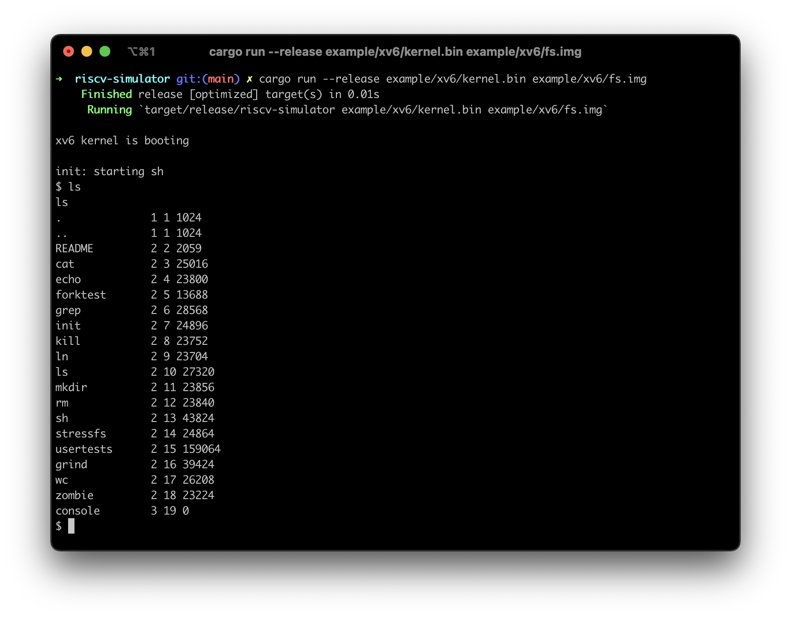

# riscv-simulator
用于练习的 risc-v 模拟器

## Boot [xv6-riscv](https://github.com/mit-pdos/xv6-riscv)

[xv6](https://github.com/mit-pdos/xv6-riscv) is a simple Unix-like operating system

## Getting Start

```bash
git clone https://github.com/tw666/riscv-simulator
cd riscv-simulator

# run xv6
cargo run --release example/xv6/kernel.bin example/xv6/fs.img
```

## References
- [riscv/riscv-isa-sim](https://github.com/riscv/riscv-isa-sim)
- [d0iasm/rvemu](https://github.com/d0iasm/rvemu)
- [shady831213/terminus](https://github.com/shady831213/terminus)